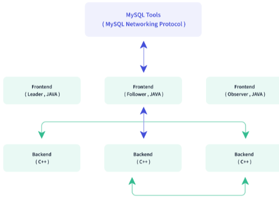

# Doris学习记录

Doris数据库是一个分布式列式存储和查询系统，主要用于实时分析和查询海量数据。

MySQL 可以作为数据源，将数据抽取、转换后加载到 Doris 中进行分析。例如，电商平台的交易数据先在 MySQL 中进行事务处理，然后定时将数据同步到 Doris，供分析师进行销售数据分析。

## Doris架构

Doris 采用 MySQL 协议，高度兼容 MySQL 语法，支持标准 SQL。

Apache Doris 存算一体架构精简易于维护，如下图所示，只有两类进程：



Apache Doris 存算一体架构精简易于维护，如下图所示，只有两类进程：

- Frontend（FE）：主要负责用户请求的接入、查询解析规划、元数据的管理、节点管理相关工作。

在生产环境中可以部署多个 FE 节点做容灾备份，每个 FE 中都会维护全量的元数据副本。FE 分为三种角色：

| 角色     | 功能                                                         |
| -------- | ------------------------------------------------------------ |
| Master   | FE Master 节点负责元数据的读写，在 Master 元数据发生变更后，会通过 BDB JE 协议同步给 Follower 或 Observer 节点。 |
| Follower | Follower 节点负责读取元数据，在 Master 节点发生故障时，Follower 节点可以被选取作为新的 Master 节点。 |
| Observer | Observer 节点负责读取元数据，主要为了增加集群的查询并发行。不参加集群选主。 |

- Backend（BE）：主要负责数据存储、查询计划的执行。数据会被切分成分片，在 BE 中多副本存储。

FE 与 BE 进程都是可以横向扩展的，单集群可以支持到数百台机器，数十 PB 的存储容量。FE 与 BE 进程通过一致性协议来保证服务的高可用和数据的高可靠。存算一体架构高度集成，大幅降低了分布式系统的运维成本。

## 模型

在 Doris 中支持三种表模型：

1. 明细模型（Duplicate Key Model）：

   允许指定的 Key 列重复，Doirs 存储层保留所有写入的数据，适用于必须保留所有原始数据记录的情况；

2. 主键模型（Unique Key Model）：

   每一行的 Key 值唯一，可确保给定的 Key 列不会存在重复行，Doris 存储层对每个 key 只保留最新写入的数据，适用于数据更新的情况；

3. 聚合模型（Aggregate Key Model）：

   可根据 Key 列聚合数据，Doris 存储层保留聚合后的数据，从而可以减少存储空间和提升查询性能；通常用于需要汇总或聚合信息（如总数或平均值）的情况。

## 明细模型

在明细模型是 Doris 中默认建表的模型，可以使用明细模型保存每一条原始数据记录。在建表时指定的 **Duplicate Key**，以指明数据存储按照哪些列进行排序，可以用于优化常用查询。一般建议选择三列以下的列作为排序键。明细模型有以下特点：

- 保留原始数据：明细模型保留了全量的原始数据，适合于存储与查询原始数据。对于后期希望做详细数据分析的应用场景，建议使用明细模型，避免数据丢失的风险；
- 不去重也不聚合：与聚合模型与主键模型不同，明细模型不会对数据进行去重与聚合操作。每次数据插入时，即使两条相同的数据，都会被完整保留；
- 灵活的数据查询：明细模型保留了全量的原始数据，可以从完整数据中提取细节，基于全量数据做任意维度的聚合操作，从而进行元数数据的审计及细粒度的分析。

#### 使用场景

明细模型中的数据只**进行追加**，旧数据**不会更新**。明细模型一般用于需要全量原始数据的场景：

- 日志存储：用于存储各类的程序操作日志，如访问日志、错误日志等。每一条数据都需要被详细记录，方便后续的审计与分析；
- 用户行为数据：在分析用户行为时，如点击数据、用户访问轨迹等，需要保留用户的详细行为，方便后续构建用户画像及对行为路径进行详细分析；
- 交易数据：在某些存储交易行为或订单数据时，交易结束时一般不会发生数据变更。明细模型适合保留这一类交易信息，不遗漏任意一笔记录，方便对交易进行精确的对账。

#### 建表说明

在建表时，可以通过 `DUPLICATE KEY` 关键字指定明细模型。明细表必须指定数据的 Key 列，用于在存储时对数据进行排序。

下例的明细表中存储了日志信息，并针对于 `log_time`、`log_type` 及 `error_code` 三列进行了排序：


```sql
CREATE TABLE IF NOT EXISTS example_tbl_duplicate
(
    log_time        DATETIME       NOT NULL,
    log_type        INT            NOT NULL,
    error_code      INT,
    error_msg       VARCHAR(1024),
    op_id           BIGINT,
    op_time         DATETIME
)
DUPLICATE KEY(log_time, log_type, error_code)
DISTRIBUTED BY HASH(log_type) BUCKETS 10;
```

#### 数据插入与存储

在明细表中，数据不进行去重与聚合，插入数据即存储数据。明细模型中 Key 列指做为排序。


如在上例中，表中原有 4 行数据，在插入 2 行数据后，以追加（APPEND）的方式插入到表中，明细表存储共 6 行数据：

```sql
-- 4 rows raw data
INSERT INTO example_tbl_duplicate VALUES
('2024-11-01 00:00:00', 2, 2, 'timeout', 12, '2024-11-01 01:00:00'),
('2024-11-02 00:00:00', 1, 2, 'success', 13, '2024-11-02 01:00:00'),
('2024-11-03 00:00:00', 2, 2, 'unknown', 13, '2024-11-03 01:00:00'),
('2024-11-04 00:00:00', 2, 2, 'unknown', 12, '2024-11-04 01:00:00');

-- insert into 2 rows
INSERT INTO example_tbl_duplicate VALUES
('2024-11-01 00:00:00', 2, 2, 'timeout', 12, '2024-11-01 01:00:00'),
('2024-11-01 00:00:00', 2, 2, 'unknown', 13, '2024-11-01 01:00:00');

-- check the rows of table
SELECT * FROM example_tbl_duplicate;
+---------------------+----------+------------+-----------+-------+---------------------+
| log_time            | log_type | error_code | error_msg | op_id | op_time             |
+---------------------+----------+------------+-----------+-------+---------------------+
| 2024-11-02 00:00:00 |        1 |          2 | success   |    13 | 2024-11-02 01:00:00 |
| 2024-11-01 00:00:00 |        2 |          2 | timeout   |    12 | 2024-11-01 01:00:00 |
| 2024-11-03 00:00:00 |        2 |          2 | unknown   |    13 | 2024-11-03 01:00:00 |
| 2024-11-04 00:00:00 |        2 |          2 | unknown   |    12 | 2024-11-04 01:00:00 |
| 2024-11-01 00:00:00 |        2 |          2 | unknown   |    13 | 2024-11-01 01:00:00 |
| 2024-11-01 00:00:00 |        2 |          2 | timeout   |    12 | 2024-11-01 01:00:00 |
+---------------------+----------+------------+-----------+-------+---------------------+
```

## 主键模型

在需要有数据更新时，可以选择使用主键模型（Unique Key Model）。主键模型可以保证 Key 列的唯一性，当用户插入或更新数据时，新写入的数据会覆盖具有相同 Key 列的旧数据，从而保持最新的数据记录。与其他数据模型相比，主键模型适用于数据的更新场景，可以在插入过程中进行主键级别的更新覆盖。

主键模型有以下特点：

- 基于主键完成 UPSERT ：在插入数据时，主键重复的数据会更新，主键不存在的记录会插入；
- 基于主键进行去重：主键模型中的 Key 列具有唯一性，会对根据主键列对数据进行去重操作；
- 可以进行高频数据更新：支持高频数据更新场景，同时平衡数据更新性能与查询性能。

#### 使用场景

- 高频数据更新：上游 OLTP 数据库维度表高频的进行谁更新，通过主键表可以实时同步上游更新记录，完成高效的 UPSERT 操作；
- 数据高效去重：如广告投放营销、客户关系管理系统中，需要针对用户做去重操作，使用主键模型，可以保证基于用户 ID 做高效去重操作；
- 需要部分记录更新：在部分业务场景中，只需要对某几列进行更新，如画像标签场景需要变更频繁改动的动态标签，消费订单场景需要改变交易的状态。通过主键模型部分列更新能力可以完成某几列的变更操作。

#### 实现方式

在 Doris 中主键模型有两种实现方式：

- 写时合并（merge-on-write）：在 1.2 版本后，Doris 中的主键模型默认使用写时合并模式，数据在写入时立即进行相同 Key 的合并，确保每次写入后的数据存储状态是唯一键的最终合并结果，只存储最新结果。写时合并可以很好的兼顾查询与写入的性能，在查询时避免多个版本的数据合并，保证谓词下推到存储层。绝大部分的场景都推荐使用写时合并模型；
- 读时合并（merge-on-read）：在 1.2 版本前，Doris 中的主键模型默认使用读时合并模式，数据在写入时并不进行合并，以增量的方式被追加存储，在 Doris 内保留多个版本。查询或 Compaction 时，会对数据进行相同 Key 的版本合并。读时合并适合写多读少的场景，在查询是需要进行多个版本合并，谓词无法下推，可能会影响到查询速度。

在 Doris 中基于主键模型更新有两种语义：

- Unique 模型默认的更新语义为整行`UPSERT`，即 UPDATE OR INSERT，该行数据的 Key 如果存在，则进行更新，如果不存在，则进行新数据插入。在整行`UPSERT`语义下，即使用户使用 Insert Into 指定部分列进行写入，Doris 也会在 Planner 中将未提供的列使用 NULL 值或者默认值进行填充。
- 部分列更新。如果用户希望更新部分字段，需要使用写时合并实现，并通过特定的参数来开启部分列更新的支持。

#### 写时合并

##### 创建写时合并表

在建表时，使用 UNIQUE KEY 关键字可以指定主键表。通过显示开启 `enable_unique_key_merge_on_write` 属性可以指定写时合并模式。自 Doris 2.1 版本以后，默认开启写时合并：

```sql
CREATE TABLE IF NOT EXISTS example_tbl_unique
(
    user_id         LARGEINT        NOT NULL,
    user_name       VARCHAR(50)     NOT NULL,
    city            VARCHAR(20),
    age             SMALLINT,
    sex             TINYINT
)
UNIQUE KEY(user_id, user_name)
DISTRIBUTED BY HASH(user_id) BUCKETS 10
PROPERTIES (
    "enable_unique_key_merge_on_write" = "true"
);
```

#### 读时合并

##### 创建读时合并表

在建表时，使用 UNIQUE KEY 关键字可以指定主键表。通过显示关闭 `enable_unique_key_merge_on_write` 属性可以指定读时合并模式。在 Doris 2.1 版本之前，默认开启读时合并：

```sql
CREATE TABLE IF NOT EXISTS example_tbl_unique
(
    user_id         LARGEINT        NOT NULL,
    username        VARCHAR(50)     NOT NULL,
    city            VARCHAR(20),
    age             SMALLINT,
    sex             TINYINT
)
UNIQUE KEY(user_id, username)
DISTRIBUTED BY HASH(user_id) BUCKETS 10
PROPERTIES (
    "enable_unique_key_merge_on_write" = "false"
);
```

#### 数据插入与存储

在明细表（可能采用主键模型或明细模型）中，Key 列不仅会进行排序，还会基于 Key 列进行去重，插入数据后，新写入的数据会覆盖 Key 列相同的记录。


如在上例中，原表中有 4 行数据，在插入两行后，新插入的两行基于主键进行了更新操作：

```sql
-- insert into raw data
INSERT INTO example_tbl_unique VALUES
(101, 'Tom', 'BJ', 26, 1),
(102, 'Jason', 'BJ', 27, 1),
(103, 'Juice', 'SH', 20, 2),
(104, 'Olivia', 'SZ', 22, 2);

-- insert into data to update by key
INSERT INTO example_tbl_unique VALUES
(101, 'Tom', 'BJ', 27, 1),
(102, 'Jason', 'SH', 28, 1);

-- check updated data
SELECT * FROM example_tbl_unique;
+---------+----------+------+------+------+
| user_id | username | city | age  | sex  |
+---------+----------+------+------+------+
| 101     | Tom      | BJ   |   27 |    1 |
| 102     | Jason    | SH   |   28 |    1 |
| 104     | Olivia   | SZ   |   22 |    2 |
| 103     | Juice    | SH   |   20 |    2 |
+---------+----------+------+------+------+
```

## 聚合模型

Doris 的聚合模型是为了高效地处理大规模数据查询中的聚合操作而设计的。聚合模型通过对数据进行预聚合操作，减少了计算的重复性，提升了查询性能。聚合模型支持常见的聚合函数，可以在不同粒度上执行聚合操作。在聚合模型中，只存储聚合后的数据，不存储原始数据，减少了存储空间并提升了查询性能。

#### 使用场景

- 对于明细数据进行汇总：如电商平台需要评估月销售总业绩、金融风控需要查询客户交易总额、广告投放需要分析广告总点击量等业务场景中，针对明细数据进行多维度的汇总操作；
- 不需要查询原始明细数据：如驾驶舱报表、用户交易行为分析等业务，原始数据存储在数据湖中，在入库时不需要保留原始数据，只需要存储汇总后的数据；

#### 原理

每一次数据导入会在聚合模型内形成一个版本，在 Compaction 阶段进行版本合并，在查询时会按照主键进行数据聚合：

- 数据导入阶段
  - 数据按批次导入到聚合表，每个批次形成一个版本。
  - 在每个版本中，对相同聚合键的数据进行初步聚合（如求和、计数等）。
- 后台文件合并阶段（Compaction）
  - 多个批次生成多个版本文件，定期合并成一个大版本文件。
  - 合并过程中，同一聚合键的数据会再次聚合，以减少冗余并优化存储。
- 查询阶段
  - 查询时，系统会从所有版本中聚合同一聚合键的数据，确保结果准确。
  - 通过聚合多个版本的数据，返回最终的查询结果。

#### 建表说明

在建表时，可以通过 AGGREGATE KEY 关键字指定聚合模型。聚合模型必须指定 Key 列，用于在存储时按照 Key 列进行 Value 列的聚合操作。

```sql
CREATE TABLE IF NOT EXISTS example_tbl_agg
(
    user_id             LARGEINT    NOT NULL,
    load_dt             DATE        NOT NULL,
    city                VARCHAR(20),
    last_visit_dt       DATETIME    REPLACE DEFAULT "1970-01-01 00:00:00",
    cost                BIGINT      SUM DEFAULT "0",
    max_dwell           INT         MAX DEFAULT "0",
)
AGGREGATE KEY(user_id, date, city)
DISTRIBUTED BY HASH(user_id) BUCKETS 10;
```

上例中定义了用户信息和访问的行为事实表，将 `user_id`、`load_date`、`city` 及 `age` 作为 Key 列进行聚合操作。数据导入时，Key 列会聚合成一行，Value 列会按照指定的聚合类型进行维度聚合。在聚合表中支持以下类型的维度聚合：

- SUM：求和，多行的 Value 进行累加。
- REPLACE：替代，下一批数据中的 Value 会替换之前导入过的行中的 Value。
- MAX：保留最大值。
- MIN：保留最小值。
- REPLACE_IF_NOT_NULL：非空值替换。和 REPLACE 的区别在于对于 null 值，不做替换。
- HLL_UNION：HLL 类型的列的聚合方式，通过 HyperLogLog 算法聚合。
- BITMAP_UNION：BIMTAP 类型的列的聚合方式，进行位图的并集聚合。

#### 使用实例

假设要统计电商平台的销售数据，需要按商品 ID、销售日期对销售金额和销售数量进行聚合统计。

**1.创建聚合表**

```sql
CREATE TABLE IF NOT EXISTS sales_aggregation (
    -- 聚合键（Key 列），用于分组
    product_id INT NOT NULL,
    sale_date DATE NOT NULL,
    -- 值列（Value 列），并指定聚合函数
    sales_amount DECIMAL(10, 2) SUM,
    sales_quantity INT SUM
)
AGGREGATE KEY(product_id, sale_date)
DISTRIBUTED BY HASH(product_id) BUCKETS 10;
```

在这个建表语句中：

- `product_id` 和 `sale_date` 是聚合键，用于确定数据的分组规则。
- `sales_amount` 使用 `SUM` 聚合函数，用于统计每个商品每天的销售总额。
- `sales_quantity` 使用 `SUM` 聚合函数，用于统计每个商品每天的销售总量。
- `DISTRIBUTED BY HASH(product_id) BUCKETS 10` 表示按 `product_id` 进行哈希分桶，分为 10 个桶，以实现数据的分布式存储。

**2. 数据导入阶段**

第一批数据导入

```sql
INSERT INTO sales_aggregation (product_id, sale_date, sales_amount, sales_quantity)
VALUES 
(1, '2024-01-01', 100.00, 10),
(1, '2024-01-01', 200.00, 20),
(2, '2024-01-01', 150.00, 15);
```

在第一批数据导入后，会形成一个版本（假设为版本 1）。在这个版本内，Doris 会对相同聚合键的数据进行初步聚合：

- 对于 `product_id = 1` 且 `sale_date = '2024-01-01'` 的记录，`sales_amount` 会聚合为 `100.00 + 200.00 = 300.00`，`sales_quantity` 会聚合为 `10 + 20 = 30`。
- 对于 `product_id = 2` 且 `sale_date = '2024-01-01'` 的记录，`sales_amount` 为 `150.00`，`sales_quantity` 为 `15`。

第二批数据导入

```sql
INSERT INTO sales_aggregation (product_id, sale_date, sales_amount, sales_quantity)
VALUES 
(1, '2024-01-01', 50.00, 5),
(2, '2024-01-01', 80.00, 8);
```

第二批数据导入后，会形成一个新的版本（假设为版本 2）。同样，在版本 2 内，会对相同聚合键的数据进行初步聚合：

- 对于 `product_id = 1` 且 `sale_date = '2024-01-01'` 的记录，`sales_amount` 为 `50.00`，`sales_quantity` 为 `5`。
- 对于 `product_id = 2` 且 `sale_date = '2024-01-01'` 的记录，`sales_amount` 为 `80.00`，`sales_quantity` 为 `8`。

**3. 后台文件合并阶段（Compaction）**

在 Compaction 阶段，Doris 会将版本 1 和版本 2 的文件合并成一个大版本文件。合并过程中，同一聚合键的数据会再次聚合：

- 对于 `product_id = 1` 且 `sale_date = '2024-01-01'` 的记录，`sales_amount` 会聚合为 `300.00 + 50.00 = 350.00`，`sales_quantity` 会聚合为 `30 + 5 = 35`。
- 对于 `product_id = 2` 且 `sale_date = '2024-01-01'` 的记录，`sales_amount` 会聚合为 `150.00 + 80.00 = 230.00`，`sales_quantity` 会聚合为 `15 + 8 = 23`。

**4. 查询阶段**

```sql
SELECT product_id, sale_date, sales_amount, sales_quantity
FROM sales_aggregation
WHERE sale_date = '2024-01-01';
```

在查询时，系统会从合并后的大版本文件中获取数据，最终返回的结果如下：

| product_id | sale_date  | sales_amount | sales_quantity |
| ---------- | ---------- | ------------ | -------------- |
| 1          | 2024-01-01 | 350.00       | 35             |
| 2          | 2024-01-01 | 230.00       | 23             |

## 数据分布

### 概念

**分区（Partition）**

**概念**：将表的数据按照一定的规则划分成不同的子集，每个子集就是一个分区。用户可以根据数据的特性（如时间、地域等）选择合适的分区键进行分区操作。

常见分区类型及应用场景

- **范围分区**：按照某列的值的范围进行分区，常用于按时间列进行分区，例如将一张销售记录表按年月进行范围分区，每年每个月的数据存储在不同的分区中。在查询特定时间段的数据时，只需扫描对应的分区，能显著减少扫描的数据量，提高查询效率。
- **列表分区**：依据列的离散值进行分区，适合有明确分类的数据。比如，一张用户信息表按照用户所在的城市进行列表分区，将北京、上海、广州等不同城市的用户数据分别存储在不同分区，方便对特定城市的用户数据进行管理和查询。
- **哈希分区**：对指定列进行哈希运算，根据哈希结果将数据划分到不同分区。它能使数据较为均匀地分布在各个分区中，避免数据倾斜，常用于对数据均匀性要求较高的场景。

**分桶（Bucket）**

**概念**：分桶是在分区的基础上，将每个分区的数据进一步划分成更小的存储单元，即桶（Bucket）。分桶通常基于对指定列进行哈希计算，根据计算结果决定数据存储在哪个桶中。

- **提升查询性能**：在进行表连接等操作时，如果连接列是分桶列，Doris 可以直接在对应的桶之间进行连接，减少了不必要的数据比较，提高连接操作的效率。
- **数据均衡**：确保数据在各个桶之间均匀分布，避免因数据倾斜导致部分节点负载过高，影响系统性能。
- **支持抽样查询**：通过指定从特定的桶中读取数据，可以快速获取具有代表性的样本数据，满足数据分析和测试的需求。

**副本（Replica）**

**概念**：为了保证数据的高可用性和容错性，Doris 会为每个数据分片（分区中的桶）创建多个副本。这些副本会分布在不同的节点上，当某个节点出现故障时，系统可以使用其他副本继续提供服务。

- **副本数量**：用户可以根据实际需求设置副本的数量，一般建议设置 3 个副本，这样既能保证数据的可靠性，又能在一定程度上平衡存储成本。
- **副本分布**：Doris 会尽量将副本均匀地分布在不同的节点上，避免因某个节点故障导致多个副本同时丢失的情况。同时，为了减少网络开销，副本通常会分布在不同机架的节点上。

示例

假设有一张订单表，按订单日期进行范围分区，每月一个分区。在每个分区内，按照订单 ID 进行分桶，假设有 10 个桶。并且为每个桶设置 3 个副本。这样不同月份的订单数据会存储在不同的分区中，同一月份的订单数据会根据订单 ID 的哈希值分布在 10 个桶里，每个桶又有 3 个副本分布在不同节点上。当进行查询时，系统可以快速定位到需要的分区和桶，然后根据副本情况选择合适的数据副本进行读取。

### 分区

分区是数据组织的第一层逻辑划分，用于将表中的数据划分为更小的子集。Doris 提供以下两种 **分区类型** 和三种 **分区模式**：

**分区类型：**

1. Range 分区：根据分区列的值范围将数据行分配到对应分区。
2. List 分区：根据分区列的具体值将数据行分配到对应分区。

**分区模式：**

1. 手动分区：用户手动创建分区（如建表时指定或通过 `ALTER` 语句增加）。
2. 动态分区：系统根据时间调度规则自动创建分区，但写入数据时不会按需创建分区。
3. 自动分区：数据写入时，系统根据需要自动创建相应的分区，使用时注意脏数据生成过多的分区。

**注意事项：**

- Partition 列可以指定一列或多列，分区列必须为 KEY 列。
- 不论分区列是什么类型，在写分区值时，都需要加双引号。
- 分区数量理论上没有上限。
- 当不使用 Partition 建表时，系统会自动生成一个和表名同名的，全值范围的 Partition。该 Partition 对用户不可见，并且不可删改。
- 创建分区时不可添加范围重叠的分区。

#### 分区类型

##### Range分区

**定义：**一种基于**分区键**对表进行分区的方式，分区键指的是表中的某一列，而Range则是指这个列的值的范围。使用Range分区，可以将数据按照列的值的范围进行划分，将数据分散到不同的节点上，以实现分布式存储和查询。

分区列通常为时间列，以方便的管理新旧数据。

Partition 支持通过 VALUES LESS THAN (...) 仅指定上界，系统会将前一个分区的上界作为该分区的下界，生成一个左闭右开的区间。也支持通过 VALUES [...) 指定上下界，生成一个左闭右开的区间。

**示例**：

```sql
-- Range Partition
use test_db;

CREATE TABLE IF NOT EXISTS test_db.example_range_tbl
(
    `user_id` LARGEINT NOT NULL COMMENT "用户id",
    `date` DATE NOT NULL COMMENT "数据灌入日期时间",
    `city` VARCHAR(20) COMMENT "用户所在城市",
    `age` SMALLINT COMMENT "用户年龄",
    `sex` TINYINT COMMENT "用户性别",
    `last_visit_date` DATETIME REPLACE DEFAULT "1970-01-01 00:00:00" COMMENT "用户最后一次访问时间",
    `cost` BIGINT SUM DEFAULT "0" COMMENT "用户总消费",
    `max_dwell_time` INT MAX DEFAULT "0" COMMENT "用户最大停留时间",
    `min_dwell_time` INT MIN DEFAULT "99999" COMMENT "用户最小停留时间"
)
ENGINE=OLAP
AGGREGATE KEY(`user_id`, `date`, `city`, `age`, `sex`)
PARTITION BY RANGE(`date`)
(
    PARTITION `p201701` VALUES LESS THAN ("2017-02-01"),
    PARTITION `p201702` VALUES LESS THAN ("2017-03-01"),
    PARTITION `p201703` VALUES LESS THAN ("2017-04-01")
)
DISTRIBUTED BY HASH(`user_id`) BUCKETS 16
PROPERTIES
(
    "replication_num" = "3",
    "storage_medium" = "SSD",
    "storage_cooldown_time" = "2023-05-12 12:00:00"
);

```

##### List 分区

**定义**：List 分区是根据分区列的具体值将数据行分配到对应分区。适用于分区列的值是离散的、有限集合的情况。

**示例**：假设我们有一个用户信息表，包含`city`（城市）列，我们可以按照城市名称进行 List 分区。

```sql
CREATE TABLE users (
    id INT,
    name VARCHAR(50),
    city VARCHAR(50)
)
PARTITION BY LIST (city) (
    PARTITION p_beijing VALUES IN ('Beijing'),
    PARTITION p_shanghai VALUES IN ('Shanghai'),
    PARTITION p_guangzhou VALUES IN ('Guangzhou')
);
```

在这个例子中，来自北京的用户数据会被分配到`p_beijing`分区，来自上海的用户数据会被分配到`p_shanghai`分区，来自广州的用户数据会被分配到`p_guangzhou`分区。

#### 分区模式

##### 手动分区

**定义**：用户手动创建分区，可以在建表时指定分区，也可以通过`ALTER`语句增加分区。

示例：

- **建表时指定分区**：上面的 Range 分区和 List 分区示例都是在建表时手动指定分区的。
- **通过 ALTER 语句增加分区**：对于前面的`sales`表，如果需要增加 2024 年 4 月的分区，可以使用以下语句：

```sql
ALTER TABLE sales ADD PARTITION p202404 VALUES LESS THAN ('2024-05-01');
```

**优势**：用户可以完全控制分区的创建和管理，根据业务需求灵活调整分区策略。缺点是需要手动维护分区，当数据量增长较快或分区规则复杂时，管理成本较高。

##### 动态分区

**定义**：系统根据时间调度规则自动创建分区（和数据写入无关）。通常用于按时间分区的场景，例如按天、月、年分区。

**示例**：可以通过设置动态分区的参数来实现按天自动创建分区。

```sql
-- 设置动态分区属性
ALTER TABLE sales SET (
    "dynamic_partition.enable" = "true",
    "dynamic_partition.time_unit" = "DAY",
    "dynamic_partition.start" = "-3",
    "dynamic_partition.end" = "7",
    "dynamic_partition.prefix" = "p",
    "dynamic_partition.replication_num" = "3"
);
```

在这个例子中，系统会根据当前日期，自动创建前 3 天到后 7 天的分区，分区名称以`p`开头。

**优势**：减少了手动创建分区的工作量，适用于数据按时间有序增长的场景。但由于写入数据时不会按需创建分区，如果写入的数据超出了已创建的分区范围，可能会导致写入失败。

##### 自动分区

**定义**：在数据写入时触发分区创建。这种模式下，系统会在写入数据时检查目标分区是否存在，如果不存在则自动创建。

**示例**：在写入数据时，如果遇到新的日期范围，系统会自动创建对应的分区。

**注意事项**：使用自动分区时要注意脏数据生成过多的分区问题。如果有大量不规则的数据写入，可能会导致创建大量不必要的分区，增加系统的管理成本和查询开销。因此，在使用自动分区时，需要对数据进行一定的预处理和过滤。

### 分桶

一个分区可以进一步根据业务逻辑被划分为不同的数据分桶（bucket）。每个分桶会被存储为一个物理的数据分片（tablet）。

#### 分桶类型

Doris 支持两种分桶方式：Hash 分桶与 Random 分桶。

##### Hash 分桶

在创建表或新增分区时，用户需选择一列或多列作为分桶列，并明确指定分桶的数量。在同一分区内，系统会根据分桶键和分桶数量进行哈希计算。哈希值相同的数据会被分配到同一个分桶中。例如，在下图中，p250102 分区根据 region 列被划分为 3 个分桶，哈希值相同的行被归入同一个分桶。


在以下场景中，推荐使用 Hash 分桶：

- 当业务需求频繁根据某个字段进行过滤时，可将该字段作为分桶键进行 Hash 分桶，以提高查询效率。
- 当表中数据分布相对均匀时，Hash 分桶同样是一个合适的选择。

以下示例展示了如何创建带有 Hash 分桶的表。详细语法请参考 CREATE TABLE 语句。

```sql
CREATE TABLE demo.hash_bucket_tbl(
    oid         BIGINT,
    dt          DATE,
    region      VARCHAR(10),
    amount      INT
)
DUPLICATE KEY(oid)
PARTITION BY RANGE(dt) (
    PARTITION p250101 VALUES LESS THAN("2025-01-01"),
    PARTITION p250102 VALUES LESS THAN("2025-01-02")
)
DISTRIBUTED BY HASH(region) BUCKETS 8;
```

示例中，通过 `DISTRIBUTED BY HASH(region)` 指定了创建 Hash 分桶，并选择 `region` 列作为分桶键。同时，通过 `BUCKETS 8` 指定了创建 8 个分桶。

##### Random 分桶

在每个分区中，使用 Random 分桶会随机地将数据分散到各个分桶中，不依赖于某个字段的 Hash 值进行数据划分。Random 分桶能够确保数据均匀分散，从而避免由于分桶键选择不当而引发的数据倾斜问题。

以下示例展示了如何创建带有 Random 分桶的表。详细语法请参考 CREATE TABLE 语句：

```sql
CREATE TABLE demo.random_bucket_tbl(
    oid         BIGINT,
    dt          DATE,
    region      VARCHAR(10),
    amount      INT
)
DUPLICATE KEY(oid)
PARTITION BY RANGE(dt) (
    PARTITION p250101 VALUES LESS THAN("2025-01-01"),
    PARTITION p250102 VALUES LESS THAN("2025-01-02")
)
DISTRIBUTED BY RANDOM BUCKETS 8;
```

示例中，通过 `DISTRIBUTED BY RANDOM` 语句指定了使用 Random 分桶，创建 Random 分桶无需选择分桶键，通过 `BUCKETS 8` 语句指定创建 8 个分桶。
