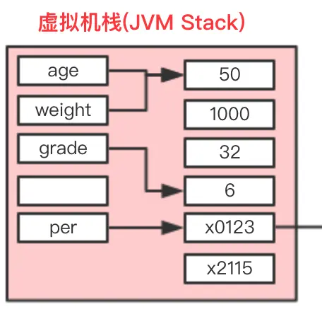

# Java中的值传递

JVM在程序运行时的内存分配有三个地方：

- 堆
- 栈
- 静态方法区
- 常量区

每个存储区域都有自己的内存分配策略：

- 堆式：
- 栈式
- 静态

Java中的数据类型有基本数据类型和引用数据类型，数据具体的存储策略：

## 基本数据类型的存储：

### 基本数据类型的局部变量

**结论：**定义基本数据类型的局部变量和数据都是直接存储在内存中的栈上。

**详解：**



方法内定义的变量直接存储在栈中：

```java
int age=50;
int weight=50;
int grade=6;
```

int age=50，分为两步：

```java
int age;//定义变量
age=50;//赋值
```

首先JVM创建一个名为age的变量，存于局部变量表中，然后去栈中查找是否存在有字面量值为50的内容，如果有就直接把age指向这个地址，如果没有，JVM会在栈中开辟一块空间来存储“50”这个内容，并且把age指向这个地址。

**声明并初始化基本数据类型的局部变量时，变量名以及字面量值都是存储在栈中，而且是真实的内容。**

int weight=50，按照刚才的思路：字面量为50的内容在栈中已经存在，因此weight是直接指向这个地址的。由此可见：**栈中的数据在当前线程下是共享的**。

执行下面的代码？

```java
weight=40；
```

当代码中重新给weight变量进行赋值时，JVM会去栈中寻找字面量为40的内容，发现没有，就会开辟一块内存空间存储40这个内容，并且把weight指向这个地址。由此可知：

**基本数据类型的数据本身是不会改变的，当局部变量重新赋值时，并不是在内存中改变字面量内容，而是重新在栈中寻找已存在的相同的数据，若栈中不存在，则重新开辟内存存新数据，并且把要重新赋值的局部变量的引用指向新数据所在地址。**

### 基本数据类型的成员变量

**结论：**基本数据类型的成员变量名和值都存储于堆中，其生命周期和对象的是一致的。

### 基本数据类型的静态变量

**结论：**基本数据类型的静态变量名以及值存储于方法区的运行时常量池中，静态变量随类加载而加载，随类消失而消失。

## 引用数据类型的存储

**结论**：对于引用数据类型的对象/数组，变量名存在栈中，变量值存储的是对象的地址，实例对象在堆中存储。

## Java中的值传递

```Java
public class TestReference {
    public static void TeacherCrossTest(Teacher teacher) {
        System.out.println("传入的Teacher的name：" + teacher.getName());
        teacher = new Teacher();
        teacher.setName("AAA");
        System.out.println("方法内重新赋值后的name：" + teacher.getName());
    }

    public static void main(String[] args) {
        Teacher p = new Teacher();
        p.setName("BBB");
        p.setAge(45);
        TeacherCrossTest(p);
        System.out.println("方法执行后的name：" + p.getName());
    }
}
```

输出的结果应该是：

```
传入的Teacher的name：BBB
方法内重新赋值后的name：AAA
方法执行后的name：BBB
```

实参p存的是堆中实例对象的地址，在传递的时候直接把地址传递了过去。而函数内的teacher最初存的是和p相同的地址，此时修改都将会被同步到p。当新new了一个Teacher实例的时候，新的地址被赋值给了teacher变量，此时teacher和p分开。