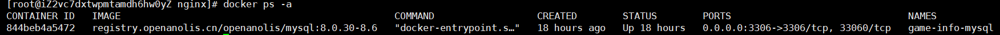

# 服务器相关

## docker

列出所有的 Docker 容器，包括正在运行的容器（已启动的）和已经停止的容器，以及已创建但尚未启动的容器。

```bash
docker ps -a
```

用于创建并启动一个新的容器实例。它会从指定的镜像创建一个新的容器，并且可以在容器启动时指定各种运行参数，如映射端口、挂载卷、设置环境变量等。使用 `docker run -d -p 80:80 nginx` ，会从 `nginx` 镜像创建一个新容器，将容器的 80 端口映射到宿主机的 80 端口，并在后台运行该容器。

```bash
docker run
```

用于启动一个已经停止的容器。用于已经创建好且处于停止状态的容器，不能从镜像直接创建新容器。有一个名为 `my - nginx` 的容器之前被停止了，就可以使用 `docker start my - nginx` 来重新启动它。

```bash
docker start
```

停止容器：

```bash
docker stop <container_name_or_id>
```

删除容器：

```bash
docker rm <container_name_or_id>
```

删除镜像：

```bash
docker rmi <image_name_or_id>
```

把当前目录的文件复制到容器内：

```bash
docker cp ./a.java my-sql:/
```

## 启动后端项目

查看进程

```bash
ps aux | grep -i 'my-springboot-app.jar'
```

监听端口

```bash
sudo ss -tuln | grep 8080
```

每次启动项目太麻烦，可以用使用shell脚本管理app：

```shell
#!/bin/bash
# 启动脚本 myapp.sh

APP_PATH="/lzh"
JAR_NAME="internet-competition-0.0.1-SNAPSHOT.jar"

case "$1" in
  start)
    nohup java -jar $APP_PATH/$JAR_NAME > $APP_PATH/nohup.out 2>&1 &
    echo "Application started."
    ;;
  stop)
    pkill -f $JAR_NAME
    echo "Application stopped."
    ;;
  restart)
    $0 stop
    sleep 2
    $0 start
    ;;
  *)
    echo "Usage: $0 {start|stop|restart}"
    exit 1
    ;;
esac
exit 0
```

给脚本加上执行权限：

```bash
chmod +x /path/to/myapp.sh
```

启动：

```bash
./myapp.sh start
```

停止：

```bash
./myapp.sh stop
```


## MySQL

查找MySQL容器：

```bash
docker ps -a
```



启动容器：

```bash
docker start game-info-mysql
```

进入docker命令：

```bash
docker exec -it game-info-mysql bash
```

容器外连接MySQL：

```bash
mysql -h 172.18.0.2 -P 3306 -u root -p
```

用户和密码：

```bash
root
```

## NGINX

指定配置文件启容器。

```bash
docker run -d --name game-info-nginx -p 80:80 \
-v /mydata/NGINX/nginx.conf:/etc/nginx/nginx.conf:ro \
registry.openanolis.cn/openanolis/nginx-accel:1.22.1-23
```

- `-d`：表示在后台以守护进程模式运行容器。
- `-p 80:80`：将容器的 80 端口映射到宿主机的 80 端口，以便外部访问。
- `-v /mydata/NGINX/nginx.conf:/etc/nginx/nginx.conf:ro`：将宿主机上的 `/mydata/NGINX/nginx.conf` 文件挂载到容器内的 `/etc/nginx/nginx.conf` 位置，并设置为只读模式（`ro`），以确保容器内的进程不会修改该文件。
- `--name nginx`：为容器命名为 `game-info-nginx`，方便后续管理。
- `registry.openanolis.cn/openanolis/nginx-accel:1.22.1-23`: 这部分指定了要使用的镜像及其标签。这里使用的是来自 `registry.openanolis.cn` 镜像仓库的 `openanolis/nginx-accel` 镜像，版本标签为 `1.22.1-23`。

